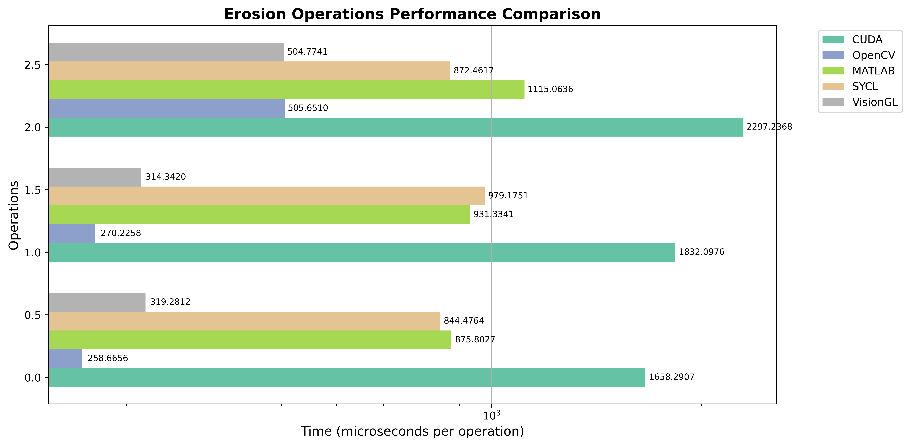
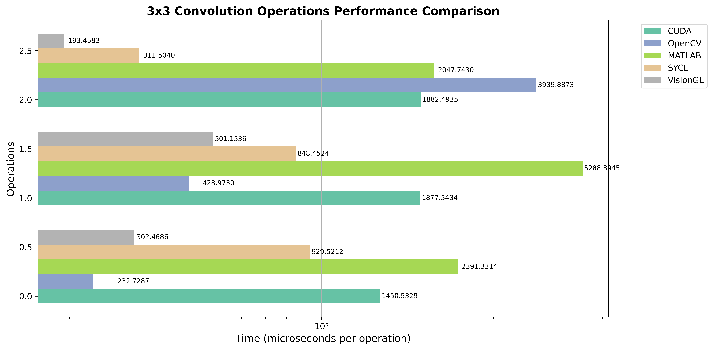
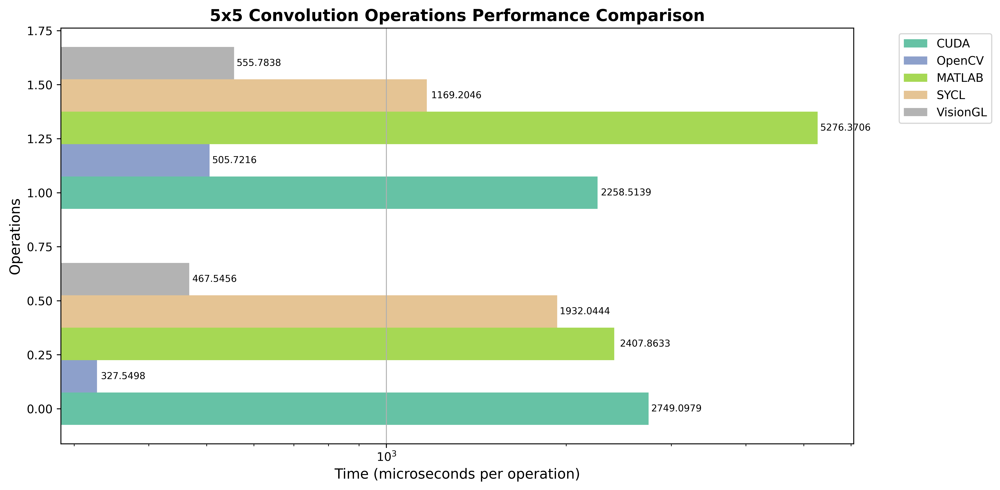

# Digital Image Processing Benchmark

Digital image processing benchmark using multiple tools to learn new ways to develop image processors.

### Testing image

You can find this image as **dr_15.JPG** zipped in **images of eyes with diabetic retinopathy** hosted at [High-Resolution Fundus (HRF) Image Database](https://www5.cs.fau.de/research/data/fundus-images/).

### Testing environment

#### Operating system

**Fedora Linux**

|         | Version    |
|---------|:----------:|
| Fedora  | 42 (Adams) |
| Kernel  | 6.17.5     |

#### Device

**NVIDIA GeForce RTX 5060 Ti**

|         | Version   |
|---------|:---------:|
| Driver  | 580.95.05 |
| CUDA    | 13.0.88   |
| OpenCL  | 3.0       |

### Benchmark results

#### [CUDA](benchmarks/cuda/)

|         | Version |
|---------|:-------:|
| Julia   | 1.12.1  |
| CUDA    | 13.0.88 |
| CUDA.jl | 5.9.2   |

| Operations                                 | Once               | Repeatedly                |
|--------------------------------------------|-------------------:|--------------------------:|
| Upload                                     |   0.005883s (once) |   0.005458s (10000 times) |
| Download                                   |    0.00586s (once) |   0.005874s (10000 times) |
| Copy                                       |     4.3e-5s (once) |   0.000518s (10000 times) |
| Inversion                                  |   0.353851s (once) |   0.000504s (10000 times) |
| Grayscale                                  |   0.099633s (once) |   0.000565s (10000 times) |
| Threshold                                  |   0.056147s (once) |   0.000520s (10000 times) |
| Erosion (3x3 Cross Kernel)                 |   0.110748s (once) |   0.001728s (10000 times) |
| Erosion (3x3 Square Kernel)                |     3.4e-5s (once) |   0.002040s (10000 times) |
| Erosion (1x3+3x1 Square Kernel)            |     3.6e-5s (once) |   0.002638s (10000 times) |
| Convolution (3x3 Gaussian Blur Kernel)     |   0.075422s (once) |   0.001362s (10000 times) |
| Convolution (1x3+3x1 Gaussian Blur Kernel) |     3.7e-5s (once) |   0.001795s (10000 times) |
| Convolution (5x5 Gaussian Blur Kernel)     |     3.4e-5s (once) |   0.002530s (10000 times) |
| Convolution (1x5+5x1 Gaussian Blur Kernel) |     3.7e-5s (once) |   0.002187s (10000 times) |
| Gaussian Blur (3x3 Kernel)                 |   0.104005s (once) |   0.001723s (10000 times) |

#### [OpenCV](benchmarks/opencv/)

|        | Version |
|--------|:-------:|
| Python | 3.13.7  |
| OpenCL | 3.0     |
| OpenCV | 4.10.0  |

| Operations                                 | Once               | Repeatedly                |
|--------------------------------------------|-------------------:|--------------------------:|
| Upload                                     |   0.001188s (once) |   0.001167s (10000 times) |
| Download                                   |   0.003050s (once) |   0.001455s (10000 times) |
| Copy                                       |   0.001431s (once) |   0.000297s (10000 times) |
| Inversion                                  |   0.000156s (once) |   0.000125s (10000 times) |
| Grayscale                                  |   0.000580s (once) |   0.000221s (10000 times) |
| Threshold                                  |   0.000122s (once) |   0.000125s (10000 times) |
| Erosion (3x3 Cross Kernel)                 |   0.000550s (once) |   0.000259s (10000 times) |
| Erosion (3x3 Square Kernel)                |   0.000453s (once) |   0.000270s (10000 times) |
| Erosion (1x3+3x1 Square Kernel)            |   0.000763s (once) |   0.000504s (10000 times) |
| Convolution (3x3 Gaussian Blur Kernel)     |   0.000521s (once) |   0.000234s (10000 times) |
| Convolution (1x3+3x1 Gaussian Blur Kernel) |   0.000774s (once) |   0.000426s (10000 times) |
| Convolution (5x5 Gaussian Blur Kernel)     |   0.000578s (once) |   0.000327s (10000 times) |
| Convolution (1x5+5x1 Gaussian Blur Kernel) |   0.000870s (once) |   0.000501s (10000 times) |
| Gaussian Blur (3x3 Kernel)                 |   0.003612s (once) |   0.003848s (10000 times) |

#### [MATLAB](benchmarks/matlab/)

|        | Version        |
|--------|:--------------:|
| CUDA   | 13.0.88        |
| MATLAB | 25.1.0.2943329 |

| Operations                                 | Once               | Repeatedly                |
|--------------------------------------------|-------------------:|--------------------------:|
| Upload                                     |   0.002975s (once) |   0.001096s (10000 times) |
| Download                                   |   0.007498s (once) |   0.002004s (10000 times) |
| Copy                                       |   0.008353s (once) |   0.000000s (10000 times) |
| Inversion                                  |   0.013583s (once) |   0.000008s (10000 times) |
| Grayscale                                  |   0.091113s (once) |   0.000692s (10000 times) |
| Threshold                                  |   0.006246s (once) |   0.000002s (10000 times) |
| Erosion (3x3 Cross Kernel)                 |   0.369444s (once) |   0.000948s (10000 times) |
| Erosion (3x3 Square Kernel)                |   0.001435s (once) |   0.000980s (10000 times) |
| Erosion (1x3+3x1 Square Kernel)            |   0.364394s (once) |   0.001169s (10000 times) |
| Convolution (3x3 Gaussian Blur Kernel)     |   2.491802s (once) |   0.002640s (10000 times) |
| Convolution (1x3+3x1 Gaussian Blur Kernel) |  20.969134s (once) |   0.005883s (10000 times) |
| Convolution (5x5 Gaussian Blur Kernel)     |   0.003758s (once) |   0.002867s (10000 times) |
| Convolution (1x5+5x1 Gaussian Blur Kernel) |   0.006611s (once) |   0.005960s (10000 times) |
| Gaussian Blur (3x3 Kernel)                 |   0.549329s (once) |   0.002245s (10000 times) |

#### [SYCL](benchmarks/sycl/)

|             | Version         |
|-------------|:---------------:|
| Clang       | 20.1.8          |
| CUDA        | 13.0.88         |
| AdaptiveCPP | commit 3992a120 |

| Operations                                 | Once               | Repeatedly                |
|--------------------------------------------|-------------------:|--------------------------:|
| Upload                                     |   0.001449s (once) |   0.001080s (10000 times) |
| Download                                   |   0.001475s (once) |   0.001469s (10000 times) |
| Copy                                       |   0.000826s (once) |   0.000125s (10000 times) |
| Inversion                                  |   0.000351s (once) |   0.000175s (10000 times) |
| Grayscale                                  |   0.000261s (once) |   0.000153s (10000 times) |
| Threshold                                  |   0.000274s (once) |   0.000177s (10000 times) |
| Erosion (3x3 Cross Kernel)                 |   0.000892s (once) |   0.000795s (10000 times) |
| Erosion (3x3 Square Kernel)                |   0.000929s (once) |   0.000922s (10000 times) |
| Erosion (1x3+3x1 Square Kernel)            |   0.000822s (once) |   0.000807s (10000 times) |
| Convolution (3x3 Gaussian Blur Kernel)     |   0.000984s (once) |   0.000875s (10000 times) |
| Convolution (1x3+3x1 Gaussian Blur Kernel) |   0.000814s (once) |   0.000799s (10000 times) |
| Convolution (5x5 Gaussian Blur Kernel)     |   0.001831s (once) |   0.001819s (10000 times) |
| Convolution (1x5+5x1 Gaussian Blur Kernel) |   0.001125s (once) |   0.001107s (10000 times) |
| Gaussian Blur (3x3 Kernel)                 |   0.000439s (once) |   0.000311s (10000 times) |

#### [VisionGL](benchmarks/visiongl/)

|             | Version        |
|-------------|:--------------:|
| Clang       | 20.1.8         |
| OpenCL      | 3.0            |
| VisionGL    | commit 4507817 |

| Operations                                 | Once               | Repeatedly                |
|--------------------------------------------|-------------------:|--------------------------:|
| Upload                                     |   0.002091s (once) |   0.001720s (10000 times) |
| Download                                   |   0.002065s (once) |   0.001982s (10000 times) |
| Copy                                       |   0.002311s (once) |   0.000192s (10000 times) |
| Inversion                                  |   0.000670s (once) |   0.000190s (10000 times) |
| Grayscale                                  |   0.000721s (once) |   0.000190s (10000 times) |
| Threshold                                  |   0.000703s (once) |   0.000188s (10000 times) |
| Erosion (3x3 Cross Kernel)                 |   0.001138s (once) |   0.000364s (10000 times) |
| Erosion (3x3 Square Kernel)                |   0.000459s (once) |   0.000323s (10000 times) |
| Erosion (1x3+3x1 Square Separated Kernel)  |   0.000762s (once) |   0.000503s (10000 times) |
| Convolution (3x3 Gaussian Blur Kernel)     |   0.001151s (once) |   0.000297s (10000 times) |
| Convolution (1x3+3x1 Gaussian Blur Kernel) |   0.000693s (once) |   0.000489s (10000 times) |
| Convolution (5x5 Gaussian Blur Kernel)     |   0.000645s (once) |   0.000507s (10000 times) |
| Convolution (1x5+5x1 Gaussian Blur Kernel) |   0.000755s (once) |   0.000629s (10000 times) |
| Gaussian Blur (3x3 Kernel)                 |   0.000728s (once) |   0.000209s (10000 times) |
